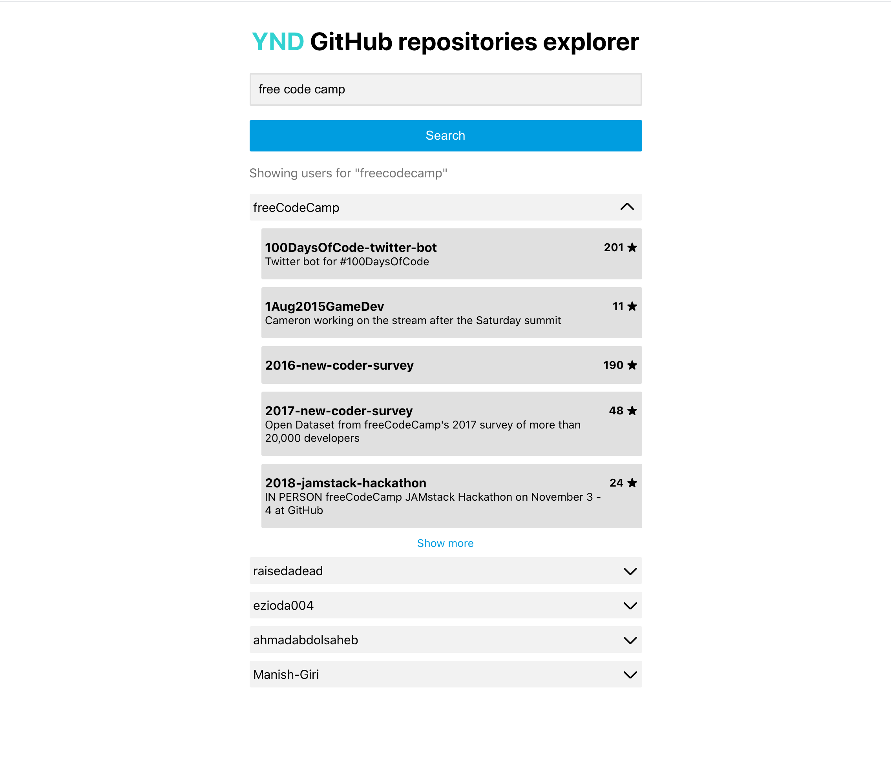

# github-explorer

An application that integrates with [github.com API](https://docs.github.com/en/free-pro-team@latest/rest) and allows to search for up to 5 GitHub users and displays their repositories.
Made as a part of the recruitment process.

You can run the application here [GitHub explorer](https://polishcodegirl.github.io/github-explorer/)



### Installation
```bash
npm install
```

### Development
```bash
npm start
```

The application will be available at http://localhost:3000/

### Building
```bash
npm run build
```

### Testing
```bash
npm test
```

### Deployment
```bash
npm run deploy
```

### Overview
To create this application I used [Create React App](https://create-react-app.dev/) which gave me an opportunity to jump strictly into the code and start to build the application.

For state management the app uses [Redux](https://redux.js.org/).

All components are styled by [styled-components](https://styled-components.com/) library which allows us to style elements directly in .js files. Additionally, I used the [styled-kit](https://www.npmjs.com/package/styled-kit) package (which has been created by my friend Robert Kirsz. It’s a package with my favourite `Div` component which is a helper wrapper for a component that makes it easy to position its children using flex attributes.

For making HTTP request to fetch or save data I used the [axios](https://www.npmjs.com/package/axios).

For the testing purpose, I used the [Testing Library](https://testing-library.com/) which was set up by Creat React App.
